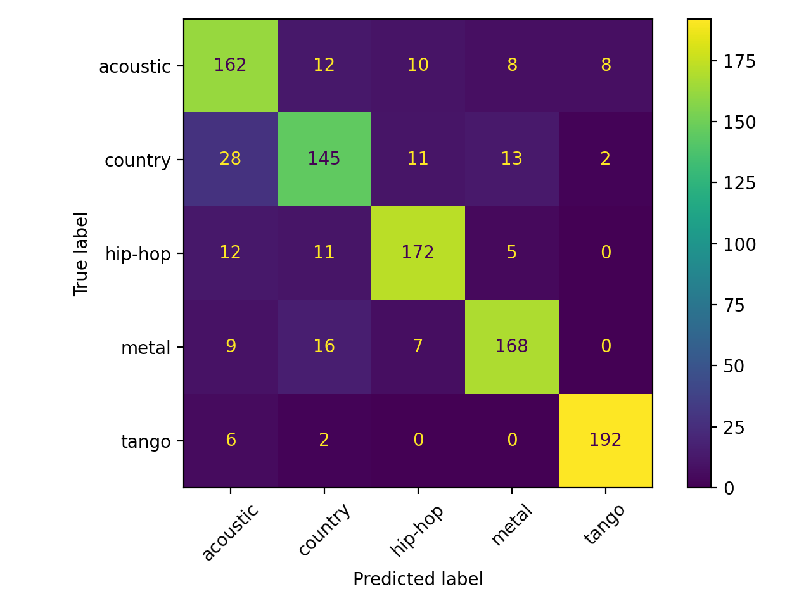
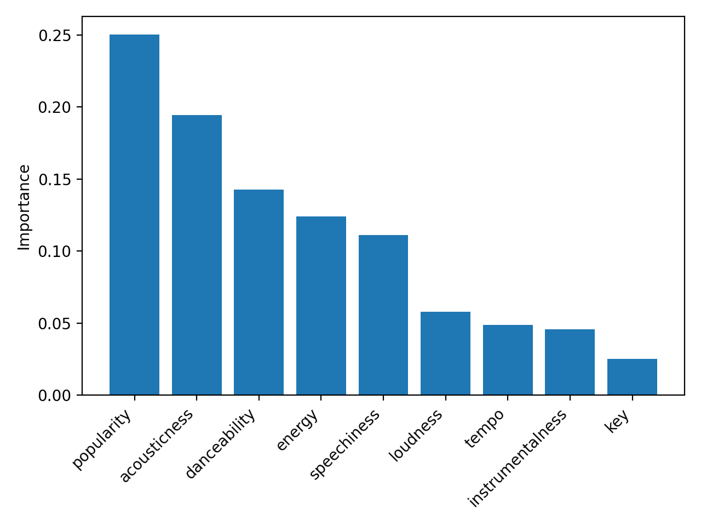

# Music Genre Classifier 
Code for Project #1: Music Genre Classification Using Machine Learning (scikit-learn). 

# Spotify Genre Classifier (scikit-learn)

Machine learning project that predicts a song’s genre from audio features using the Spotify Tracks dataset (Kaggle).

## Goal
Determine whether quantitative song metrics (e.g., tempo, loudness, danceability) can accurately classify genre.

## Approach
- Filtered dataset to 5 distinct genres: acoustic, country, hip-hop, metal, tango
- Feature scaling + train/test split (80/20)
- Trained and evaluated a Random Forest classifier
- Saved evaluation outputs (metrics + plots) for reproducibility

## Results
- Random Forest accuracy: **~0.86** on the 5-genre subset  
- Outputs generated in `results/`:
  - `metrics.txt`
  - confusion matrix
  - feature importance plot

## Example Output

## Tools
Python, pandas, scikit-learn, matplotlib

